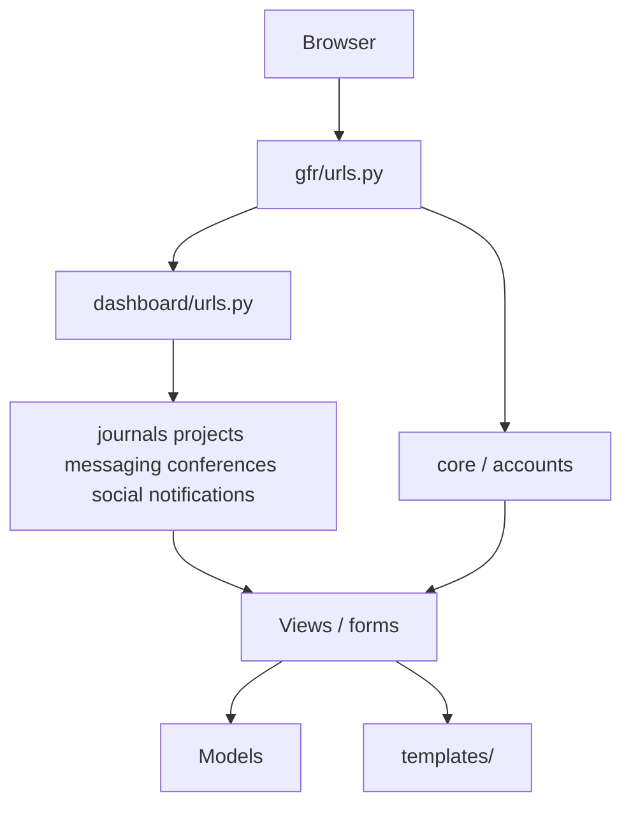
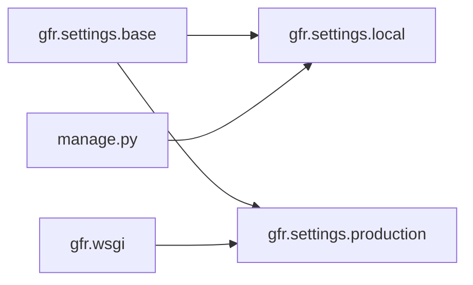

# Architecture

## Request flow

## Settings

## Modules

- **Identity:** `accounts.User` + `Role` drive permissions across journals/projects.
- **Dashboard shell:** Authenticated UX and URL aggregation under `/app/`.
- **Journals:** Double-blind-style submission and review queues (`journals`).
- **Projects:** Membership, applications, tasks with submit/review, milestones.
- **Comms:** `messaging` + `notifications`; unread counts via `gfr.context_processors`.
- **Social:** Feed under `/app/social/`.
- **Conferences:** Listings, register, abstract submit.

## Data

Default DB is SQLite at repo root (`db.sqlite3`), committed so clones share demo users/content. Production can keep that file temporarily or set `DATABASE_ENGINE` / `DATABASE_*` for MySQL (typical on PythonAnywhere) without code changes beyond env.

## Frontend

Server-rendered Django templates + Tailwind CDN. No separate frontend build step.
